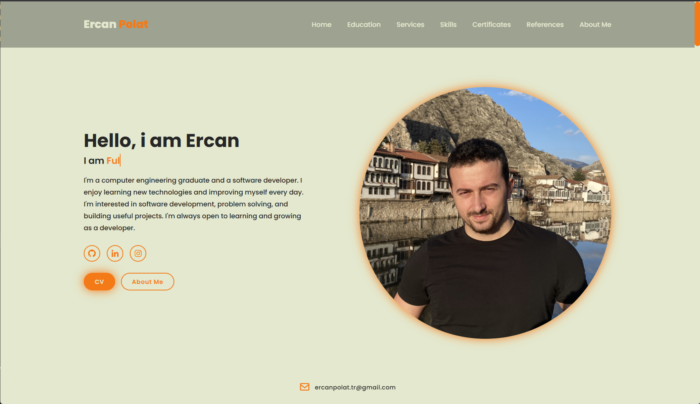
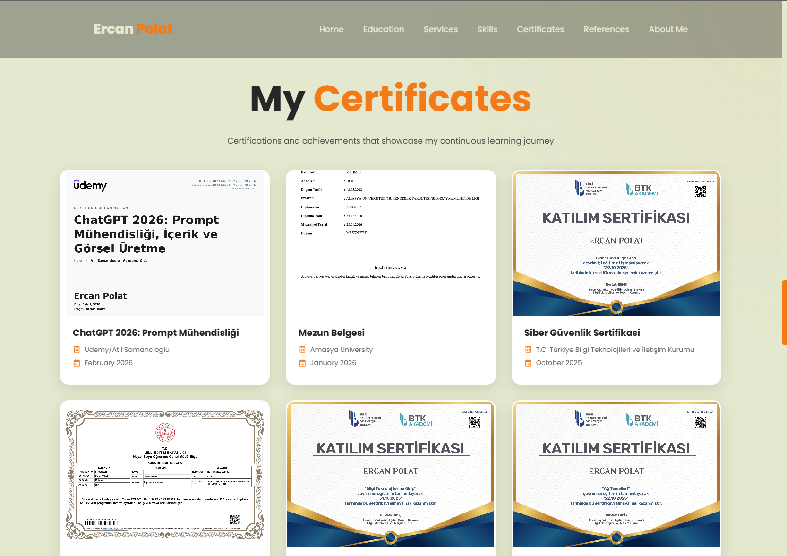

# 💼 Ercan | Personal Portfolio Website

A modern and fully responsive personal portfolio website built to showcase my technical skills, projects, and background as a Computer Engineer.

---

## 🚀 Live Demo

👉 [https://github.com/ercanpolatt/Personal-Portfolio](https://ercanpolatt.github.io/)

---

## 🧑‍💻 About The Project

This portfolio website was developed to present my professional profile in a clean, structured, and modern design.

It includes:

- A responsive navigation bar
- Smooth scrolling between sections
- Skills section with progress bars
- Structured layout using sections
- Contact area
- Mobile-friendly design

The project focuses on clean UI, structured code organization, and responsive design principles.

---

## 🛠 Technologies Used

- HTML5
- CSS3
- JavaScript (Vanilla JS)
- Boxicons
- Responsive Design (Media Queries)
- Smooth Scroll Behavior

---

